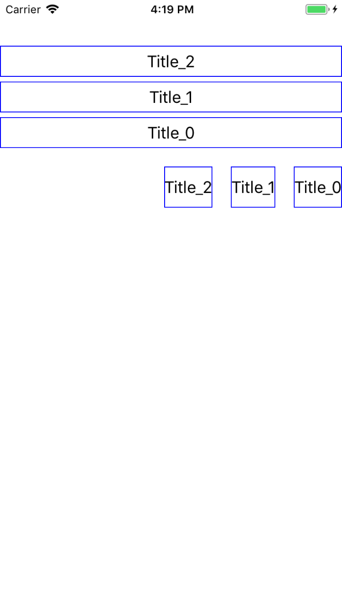

# KUIAlignmentButtonBar


[](http://cocoapods.org/?q=name%3AKUIAlignmentButtonBar%20author%3AKofktu)
[](https://github.com/Carthage/Carthage)

- Alignment Multiple Buttons



## Requirements
- iOS 8.0+
- Swift 4.0

## Installation

#### CocoaPods
KUIButtonBar is available through [CocoaPods](http://cocoapods.org). To install
it, simply add the following line to your Podfile:

```ruby
pod 'KUIAlignmentButtonBar'
```

#### Carthage
For iOS 8+ projects with [Carthage](https://github.com/Carthage/Carthage)

```
github "Kofktu/KUIAlignmentButtonBar"
```

## Usage

#### KUIAlignmentButtonBar

```swift
public class KUIAlignmentButtonBar {
    var numberOfButtons: Int = 1
    var buttonGap: CGFloat = 4.0
    var alignment: KUIAlignment = .left
    var insets: UIEdgeInsets = UIEdgeInsets.zero
}

```

#### KUIAlignmentButtonBarDelegate

```swift
protocol KUIAlignmentButtonBarDelegate {
    // Required
    func render(_ buttonBar: KUIAlignmentButtonBar, button: UIButton, index: Int)
    
    // Optional
    optional func click(_ buttonBar: KUIAlignmentButtonBar, button: UIButton, index: Int)
    optional func selected(_ buttonBar: KUIAlignmentButtonBar, button: UIButton, index: Int)
}

```

## Authors

Taeun Kim (kofktu), <kofktu@gmail.com>

## License

KUIAlignmentButtonBar is available under the ```MIT``` license. See the ```LICENSE``` file for more info.